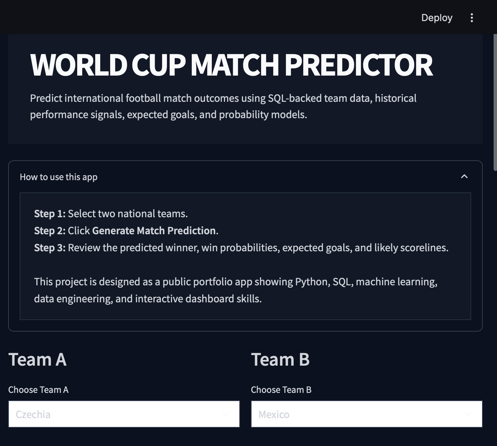
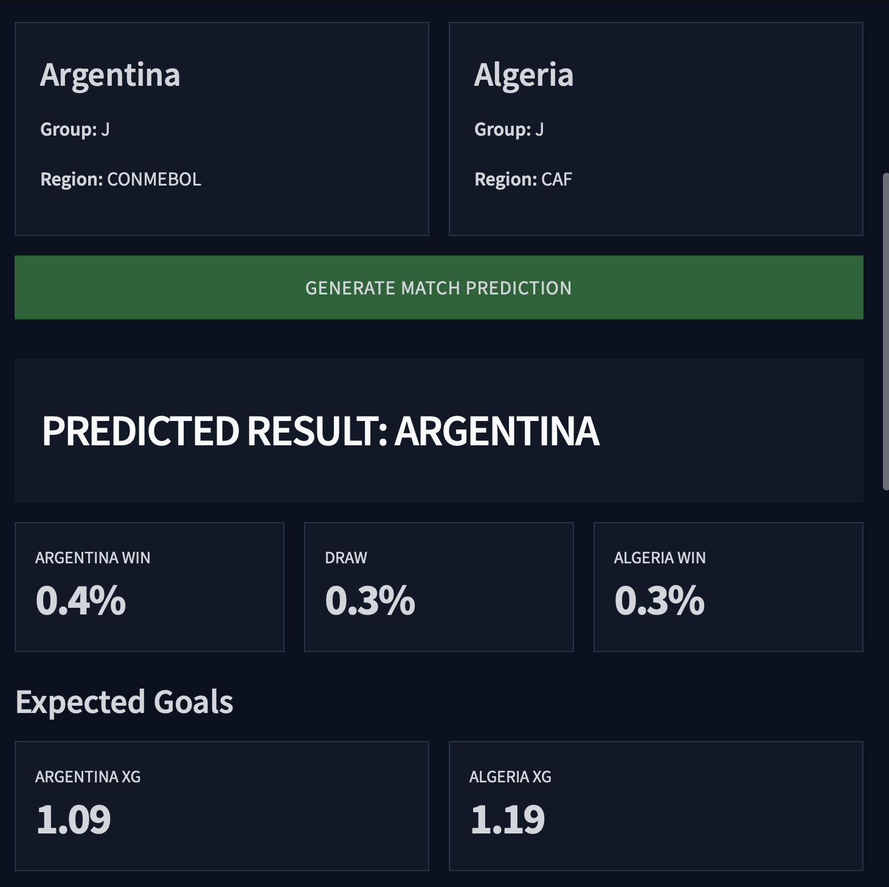
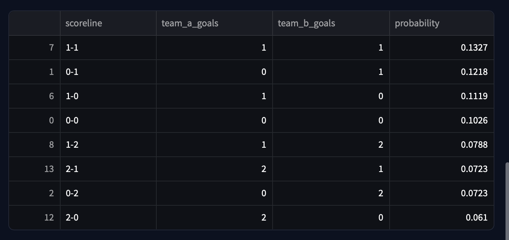

# World Cup Match Predictor


## Application Preview

### Home Screen



### Match Prediction



### Team Analysis



---

## Overview

A sports analytics application that predicts international football match outcomes using machine learning, SQL, and historical match data.
A sports analytics application that predicts international football match outcomes using machine learning, SQL, and historical match data.

This project integrates **49,477 international football matches** dating back to **1872** from the Kaggle International Football Results dataset and uses SQL-powered analytics to generate:

- Match outcome probabilities
- Expected goals (xG)
- Team comparisons
- Historical performance metrics
- Scoreline forecasts

---

## Features

- Predict Team A win probability
- Predict draw probability
- Predict Team B win probability
- Estimate expected goals (xG)
- Generate likely scorelines
- Compare national teams side-by-side
- Display historical team statistics
- Store predictions in SQLite
- Interactive Streamlit dashboard

---

## Dataset

**Source:** Kaggle International Football Results Dataset

### Dataset Statistics

| Metric | Value |
|----------|----------|
| Historical Matches | 49,477 |
| Date Range | 1872 - Present |
| Data Source | Kaggle |
| Competition Types | International Matches |

The historical dataset is loaded into SQLite and used to generate team performance metrics and prediction features.

---

## Tech Stack

### Languages

- Python
- SQL

### Libraries

- pandas
- NumPy
- scikit-learn
- Streamlit

### Database

- SQLite

### Version Control

- Git
- GitHub

---

## Technical Skills Demonstrated

### Data Engineering

- CSV ingestion pipelines
- Data transformation
- SQLite database design
- Historical data integration

### SQL

- Relational database design
- Analytical queries
- Historical performance calculations
- Prediction storage and retrieval

### Machine Learning

- Match outcome prediction
- Expected goals estimation
- Feature engineering
- Model serialization with Joblib

### Software Development

- Modular Python architecture
- Interactive dashboard development
- Git version control

---

## Project Structure

```text
world-cup-match-predictor/
│
├── app/
├── src/
├── data/
├── database/
├── models/
│
├── setup_database.py
├── upgrade_world_cup_data.py
├── load_historical_matches.py
├── run_training.py
├── requirements.txt
└── README.md
```

---

## Running Locally

```bash
pip install -r requirements.txt

python setup_database.py

python upgrade_world_cup_data.py

python load_historical_matches.py

streamlit run app/app.py
```

---

## Resume Description

Built a World Cup Match Predictor using Python, SQL, SQLite, Streamlit, and machine learning. Integrated 49,477 historical international football matches from Kaggle, designed a relational database, engineered predictive features, trained machine learning models, and developed an interactive analytics dashboard for match forecasting and team comparison.
